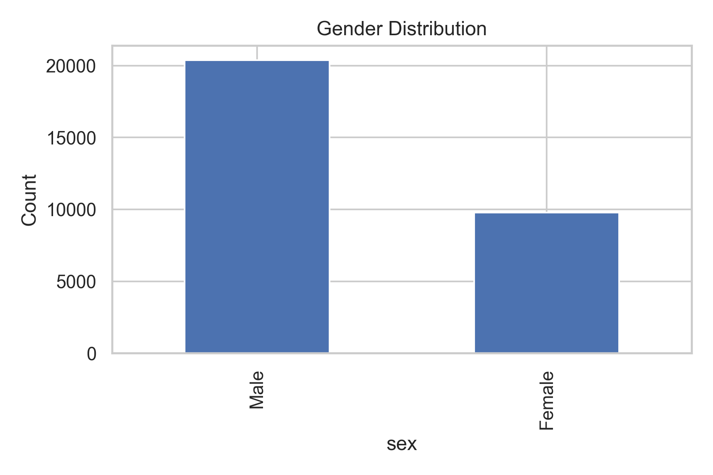
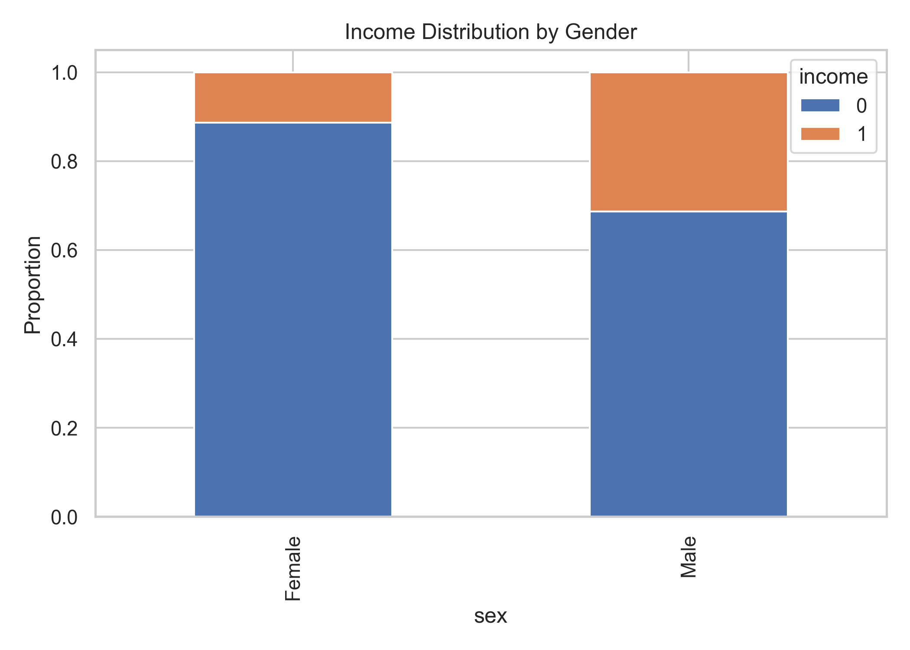
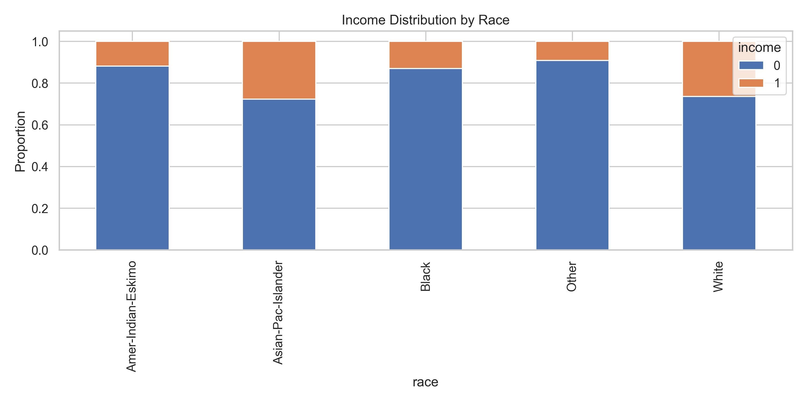
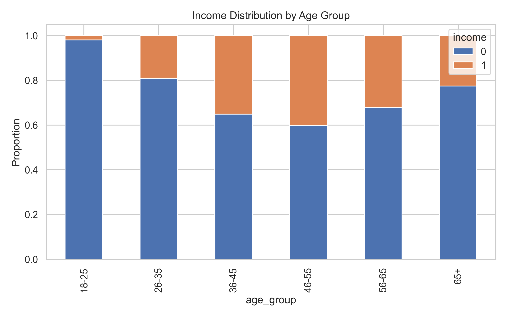

# Fairness Analysis

This section presents demographic bias patterns observed in the Adult Census Income dataset.

---

## Gender-Based Income Distribution

---

---

## Race-Based Income Distribution

---

## Age vs Income Relationship

---

## Key Insight

The dataset shows strong demographic disparities in income distribution, which indicates the presence of historical and structural bias.

These biases directly affect model learning behavior and contribute to algorithmic unfairness.