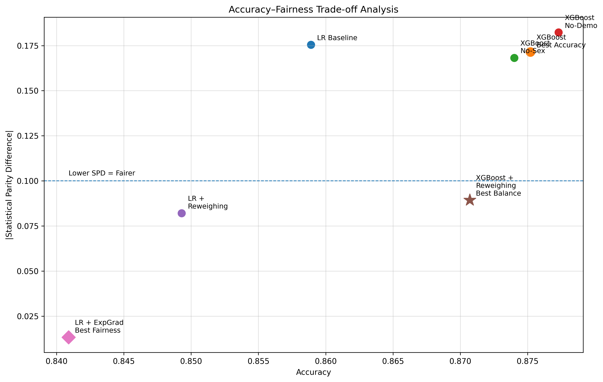

# Accuracy–Fairness Trade-off

This page presents the relationship between predictive performance and fairness.

---

## Trade-off Visualization

---

## Interpretation

- Higher accuracy models (e.g., XGBoost) tend to exhibit higher demographic disparity.
- Fairness-aware methods reduce bias but introduce performance trade-offs.
- No single model achieves both maximum accuracy and maximum fairness.

---

## Key Conclusion

This visualization confirms that fairness and accuracy are inherently competing objectives in machine learning systems.